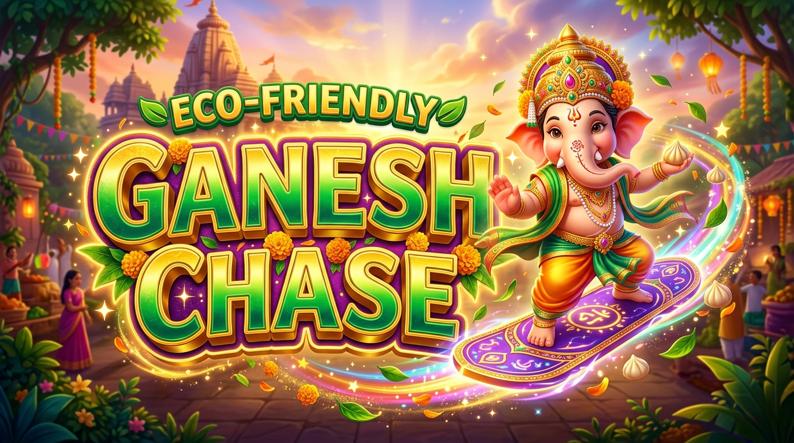

# 🐘 ganesan-run: Eco-Friendly Ganesh Chaturthi Chase

<p align="center">
  
</p>

[](https://github.com/restonuct/ganesan-run)
[](https://threejs.org/)
[](https://developer.mozilla.org/en-US/docs/Web/JavaScript)
[](https://www.khronos.org/webgl/)
[](https://developer.mozilla.org/en-US/docs/Web/CSS)
[](https://developer.mozilla.org/en-US/docs/Web/API/Web_Audio_API)
[](LICENSE)

> **ganesan-run** is a high-performance 3D Endless Runner built with **Three.js** and **WebGL**, inspired by classic arcade runners like *Subway Surfers*. Take control of Lord Ganesha on a sacred mission to clean up the city streets, chase down the Polluter Villain, and celebrate an eco-friendly festival!

---

## 📖 Overview & Story

<p align="center">
  
</p>

In **ganesan-run**, the endless runner genre meets divine mythology and environmental conservation:
- The player controls **Lord Ganesha**, sprinting across a vibrant ceremonial highway.
- In the distance, the **Polluter Villain** flees, littering hazardous toxic barrels, roadblocks, and diesel trucks.
- Ganesha's sacred quest: gather golden **Modaks**, harness divine power-ups, summon the celestial **Mooshikan** hoverboard shield, and cleanse the environment for a greener tomorrow.

---

## ✨ Key Features & Gameplay Mechanics

### 1. 3D Low-Poly Character & Environment Assets
- **Lord Ganesha**: Features an animated golden mukut (crown), ceremonial visor, ears, trunk, and smooth stride physics.
- **Mooshikan Steed**: Celestial purple and gold hoverboard that acts as an impact-absorbing crash shield.
- **Polluter Villain**: Dynamic runner fleeing along the highway who continually drops hazards.
- **Truck & Obstacle Hierarchy**:
  - **Static Garbage Trucks**: Solid lane-blocking obstacles.
  - **Moving Diesel Trucks**: Oncoming heavy vehicles with side hazard chevrons.
  - **Ramp Trucks**: Sloped obstacles that launch Ganesha smoothly onto highway catwalks.
  - **Toxic Garbage Jars**: Corrosive barrels requiring quick lane-switching or sliding underneath.

### 2. Divine Power-Up Arsenal
- **🔱 Divine Gada (Mace)**: Smash directly through roadblocks and garbage trucks with expanding golden shockwaves and bonus Modak rewards.
- **🚀 Sky Jetpack**: Soar into the clouds far above ground hazards to collect dense aerial Modak formations.
- **👟 Super Sneakers**: Grants immense vertical leap with 360° acrobatic flips and extended vertical collection range.
- **🧲 Coin Magnet**: Generates a 3-lane magnetic aura that pulls all surrounding Modaks toward Ganesha.
- **⭐ 2X Multiplier**: Doubles score and collection values for the duration of the power-up.
- **📏 Fair Pacing Spacing**: Built-in 350-meter minimum gap between power-up spawns guarantees balanced progression.

### 3. Mooshikan Workshop & Persistent Economy
- **Persistent Modak Bank**: All collected Modaks are saved across sessions via HTML5 `localStorage`.
- **In-Game Store**: Buy single boards or value bundle packs from the HUD or pause menus (1 Board = 30 🟡, 3 Boards = 75 🟡, 5 Boards = 110 🟡).
- **Haptic & Audio Feedback**: Double-tapping without boards triggers an 8-bit buzzer and visual HUD shake.

### 4. User-Gesture Audio Engine
- **Festive BGM Soundtrack**: High-quality background track loaded without autoplay to respect browser media policies.
- **Strict User-Gesture Trigger**: BGM initiates strictly on the player's first input (tap/touch on mobile or keypress on desktop).
- **Native Synthesizer SFX**: 100% real-time Web Audio API sound synthesis for jumps, coin chimes, board summons, and Gada smashes.
- **Full Playback Control**: Seamless pause/resume synchronization and instant mute toggling.

### 5. AAA Glassmorphic UI
- Responsive frosted glass HUD displaying live Modak bank, Eco-Score distance, power-up countdown bars, and multiplier badges.
- Accessible modals for Pause, Game Over statistics, and the Mooshikan Workshop.

---

## 🎮 Controls

**ganesan-run** features responsive dual-input controls for both desktop keyboards and mobile touch devices:

| Action | Desktop Keyboard | Mobile Touch / Gestures |
|---|---|---|
| **Move Left** | `←` or `A` | Swipe Left |
| **Move Right** | `→` or `D` | Swipe Right |
| **Jump / Leap** | `↑`, `W`, or `Space` | Swipe Up |
| **Slide / Roll / Fast Drop** | `↓` or `S` | Swipe Down |
| **Deploy Mooshikan Board** | `B` or Double-Tap `Space` | Double-Tap Screen / Tap HUD Icon |
| **Open Shop (🛒)** | Click HUD `🛒` Button | Tap HUD `🛒` Button |
| **Pause / Resume** | `Esc` or `P` / Click `⏸️` | Tap HUD `⏸️` Button |
| **Toggle Sound (🔊/🔇)** | Click HUD `🔊` Button | Tap HUD `🔊` Button |

---

## 🛠️ Tech Stack

- **3D Graphics Engine**: [Three.js r128](https://threejs.org/) (WebGL 2.0, PCF Soft Shadow Mapping, GLTF Loader)
- **Audio Architecture**: HTML5 Audio + Web Audio API (real-time frequency synthesis & user-gesture BGM)
- **Frontend / Styling**: Vanilla JavaScript ES6+ & CSS3 Glassmorphism (no bundling or node runtime required)
- **Storage**: Web Storage API (`localStorage`) with fail-safe error boundaries
- **Procedural 3D Generation**: Python 3 + `trimesh` scripts for procedural `.glb` asset compilation

---

## 🚀 Local Setup & Execution

Because modern browsers restrict loading 3D assets (`.glb`) and audio files over the `file://` protocol due to CORS, run a local HTTP server from the repository root:

### Option 1: Python 3 (Recommended)
```bash
python3 -m http.server 8088
```
Navigate to: [http://localhost:8088](http://localhost:8088)

### Option 2: Node.js / NPX
```bash
npx serve . -p 8088
```
Navigate to: [http://localhost:8088](http://localhost:8088)

### Option 3: VS Code Live Server
1. Install the **Live Server** extension in Visual Studio Code.
2. Open `index.html`.
3. Click **"Go Live"** in the bottom status bar or right-click and choose **"Open with Live Server"**.

---

## 📂 Project Structure

```
ganesan-run/
├── assets/                     # 3D GLTF/GLB binary models
│   ├── ganesha.glb             # Lord Ganesha runner character
│   ├── mooshikan.glb           # Sacred Mooshikan hoverboard
│   ├── villain.glb             # Polluter villain runner
│   ├── truck.glb               # Static garbage truck
│   ├── truck_moving.glb        # Oncoming diesel truck
│   ├── truck_ramp.glb          # Climbable ramp truck
│   ├── shoes.glb               # Super sneakers pickup
│   ├── jetpack.glb             # Sky flight jetpack
│   ├── magnet.glb              # 3-lane coin magnet
│   ├── multiplier.glb          # 2X score star
│   ├── modak.glb               # Sacred modak currency
│   └── garbage_jar.glb         # Toxic road hazard barrel
├── audio/                      # Game audio and music
│   └── Endless Runner Festivity.wav # Festive BGM soundtrack
├── index.html                  # Game container, HUD markup & modals
├── style.css                   # Glassmorphic styling, responsive layout
├── main.js                     # Game engine, physics loop, audio & state
├── header_logo.jpg             # Header banner image
├── title_logo.jpg              # Title screen art
├── generate_*.py               # Procedural 3D asset generators
├── LICENSE                     # MIT License
└── README.md                   # Repository documentation
```

---

## 📜 License

This project is licensed under the **MIT License** - see the [LICENSE](LICENSE) file for details.

---

<div align="center">
  <b>🌸 Ganpati Bappa Morya! Celebrate an Eco-Friendly Festival! 🌸</b><br>
  <i>Built with ❤️ for ganesan-run</i>
</div>
